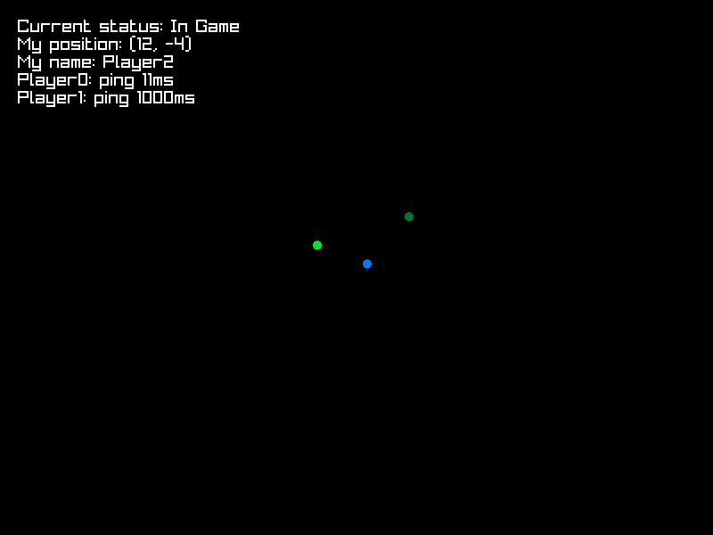

# Домашний проект по мультиплееру №1

Клиент-Лобби-Игра приложение. Для дебага есть глобальные булы ответственные за то, что выводится в консоль:

*debug_string = true* выводит логи отправки/получания сообщений 

*info_string = true* выводит обработку и логику запросов (без частых запросов как пинги)

Все периодичные запросы (пинги, позиции) уменьшены по частоте чтобы логи можно было отследить. *ping_periud = 1000* будет запускать пинг каждую секунду, *ping_periud = 16* - примерно 60 раз в секунду

# Сущности

*Для всех мест где явно не указанно обратное все пакеты отправляются надёжно*

Клиент:

- Подключается по хардкоженному адресу и порту к серверу lobby.
- Любой клиент может вызвать RequestGame нажатием Enter - переведя лобби в состояние game_started.
- При получении GotRedirectToGame клиент подключается по данным из пакета к серверу game и переходит в состояние "в игре".
- При подключении на сервер игры клиент получает информацию обо всех игроках (Name:id) через AllPlayers, а так же личные данные через ReceveName.
- В состоянии "в игре" клиент постоянно отправляет свою позицию **ненадёжно**.
- В состоянии "в игре" клиент отвечает на запросы Ping **ненадёжно** ответом Pong.
- В состоянии "в игре" клиент получает PlayersPings и UpdatePositions - информаци об игроках на сервере.
- На основе вышеуказанной информации отрисовывается интерфейс игроков и точки - позиции игрока (синим), других игроков (залёнм) и других игроков с высоким пингом/отключившихся (тёмно зелёным).

Лобби:

- Изначально находится в состоянии game_started = false.
- При получении первого RequestGame переходит в состояние game_started и пересылает всем уже подключённым клиентам информацию о подключении к серверу game через GotRedirectToGame.
- При подключении клиента к лобби в состоянии game_started - клиент сразу получает информацию через GotRedirectToGame.

Игра:

- Для подключившегося игрока создаёт (Name:id) и отправляет их клиенту. Так же отправляет ему информацию о всех уже подулюченных клиентах.
- При подключении нового клиента бродкастит PlayerJoinedGame с информацией о новом клиенте всем существующим подключениям.
- Периодически **ненадёжно** отправляет UpdatePositions всем игрокам с информацией о всех позициях.
- Периодически **ненадёжно** отправляет Ping всем игрокам.
- По получению Pong от игрока фиксирует время, потраченное на PingPong. Если на запрос не было ответа фиксированное количество времени PingPong считается 1000.
- Периодически **ненадёжно** отсылает PlayersPings с информацией о всех пингах игроков.

*Note: Сервер не обрабатывает отключение игрока, поэтому отключенный игрок для всех клиентов выглядит как игрок с очень высоким пингом. В задании ничего не сказано об обработке отключения, но в идеале мне хотелось бы докрутить способ "итендификации" в лобби, чтобы игрок мог зайти под уже существующей точкой. Но это как будет время :D*